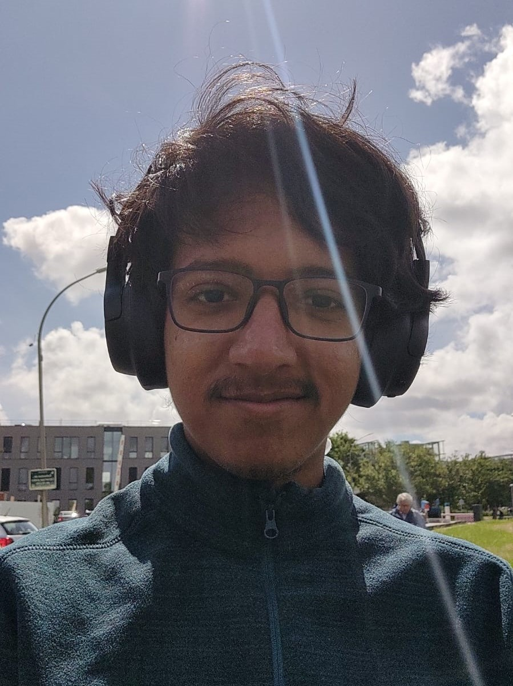

<head>

</head>

  

  
Hi! I am Gautham Viswanathan, a final year undergraduate student of mathematics and computer science at Chennai Mathematical Institute. My interests are still very broad, but my primary interests are the theories of various automata models (timed automata, vector addition systems, and asynchronous automata, to name a few). In addition to this, I also enjoy logic, proof theory, topology, and algebra.    
  I intend to use this website both to host relevant academic details about myself, and also share some of my writing with the world. I enjoy both teaching and writing fiction, so I would like to post expository writing and short stories / poetry here.

